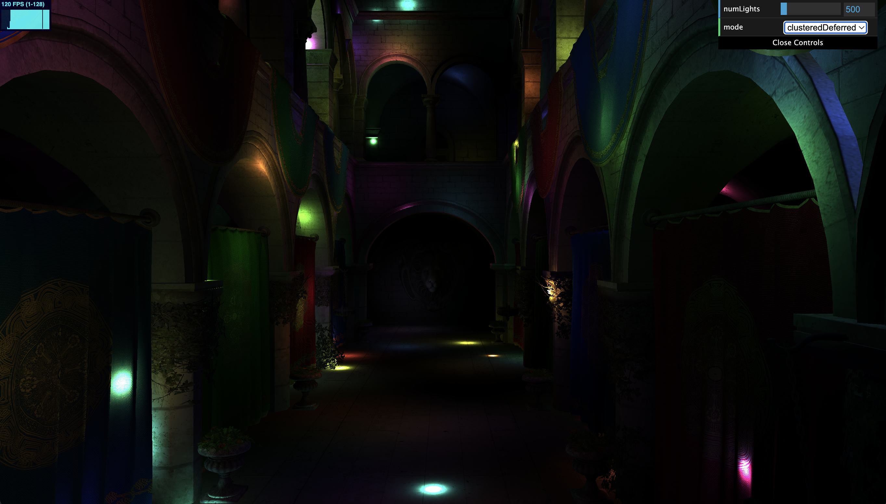
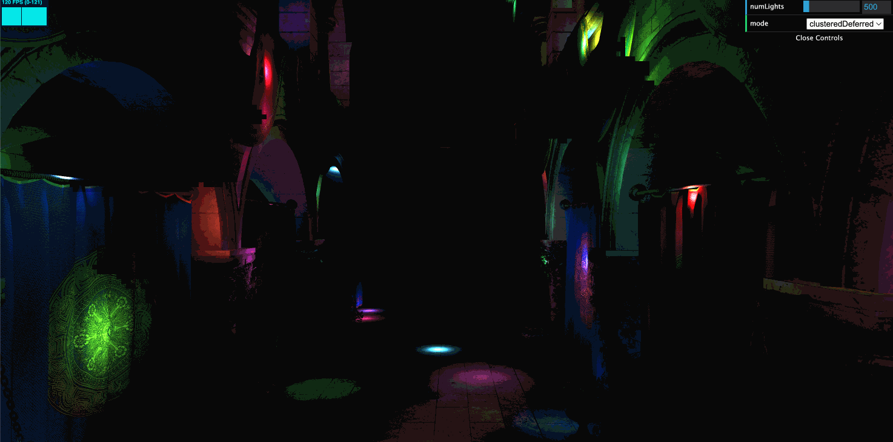
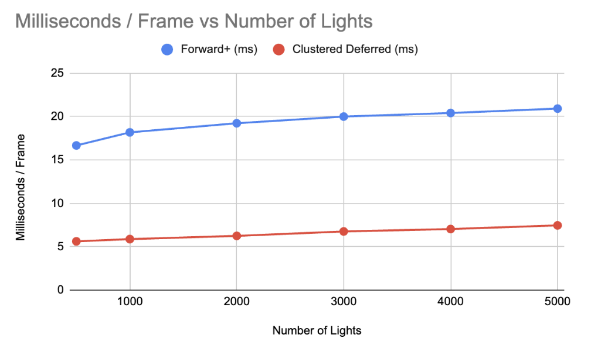
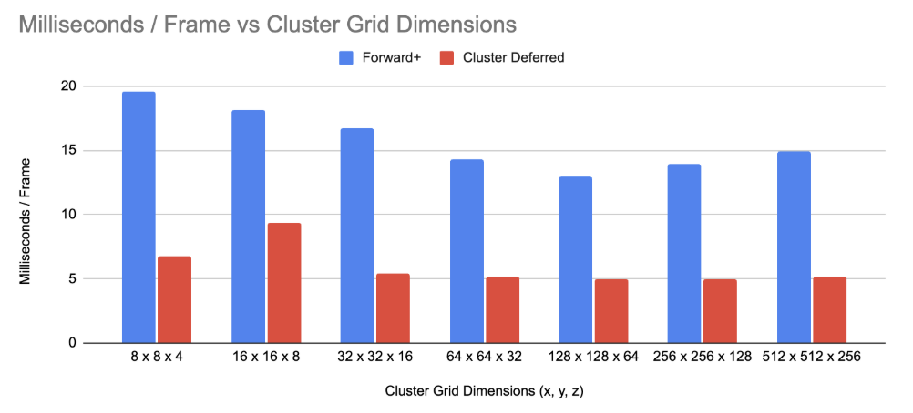

WebGL Forward+ and Clustered Deferred Shading
======================

**University of Pennsylvania, CIS 565: GPU Programming and Architecture, Project 4**

* Marcus Hedlund
  * [LinkedIn](https://www.linkedin.com/in/marcushedlund/)
* Tested on: Windows 11, Intel Core Ultra 9 185H @ 2.5 GHz 16GB, NVIDIA GeForce RTX 4070 Laptop GPU 8GB (Personal Computer)

### Live Demo

### Demo Video/GIF

# Overview
In this project I implement three shading paths, Naive, Forward+, and Clustered Deferred, for the Sponza scene with a high number of point lights. The project can be run fully in the browser through WebGPU.

### Naive
This is the baseline forward rendering pass. For every fragment it loops over all of the point lights to accumulate lighting and then modifies the diffuse color accordingly. This becomes extremely computationally expensive as the number of lights in the scene becomes large, but it is also the simplest approach.

### Forward+
The idea for Forward+ shading is to partition the camera frustum into a 3D grid of clusters. We use a compute shader to create a bounding box for each cluster and can use a sphere-box intersection test to see if the cluster's bounding box overlaps with each light's sphere of influence. Then we can assign each cluster an array of the lights it is affected by. Finally, in our fragment shader we can compute to which cluster the fragment belongs and only loop over the lights in the cluster's array when accumulating the total light. This drastically cuts down on the amount of lights we have to check for each fragment and greatly improves performance.

### Clustered Deferred
For deferred shading we reuse the same clustering process as Forward+, but split the rendering into a G-buffer pass and a fullscreen lighting pass. In the G-buffer pass we store vertex attributes like normals, albedo, and depth for later use. Then in the fullscreen lighting pass we use the clusters and the G-buffer to fetch only the relevant lights per pixel. This means that we avoid shading in fragments that won't end up being seen by the camera, saving a lot of unnecessary compute, but at the cost of higher memory usage from repeatedly using the G-buffers.

# Performance Analysis

We now discuss some of the tradeoffs and optimizations for each of the methods.

### MS/Frame vs Number of Lights

| Number of Lights | Naive (ms/frame) | Forward+ (ms/frame) | Clustered Deferred (ms/frame) |
| ---------------: | ---------------: | ------------------: | ----------------------------: |
|              500 |            66.67 |               16.67 |                          5.62 |
|             1000 |           142.86 |               18.18 |                          5.88 |
|             2000 |           250.00 |               19.23 |                          6.25 |
|             3000 |           500.00 |               20.00 |                          6.76 |
|             4000 |           500.00 |               20.41 |                          7.04 |
|             5000 |          1000.00 |               20.92 |                          7.46 |

||
|:--:|

As can be seen in the above chart and graph across all numbers of lights, the clustered deferred method is the fastest, followed by forward+, and very far behind is naive. I expected Naive to perform quite a bit worse than the other methods, but even so the amount of performance improvement they provided was surprising to me (the naive implementation would have shifted the graphs scale so much that it was omitted altogether). This makes sense given just how much computation clustering saves. Between Forward+ and Clustered deferred it also makes sense that clustered deferred runs faster because it saves so much computation by not wasting time lighting obscured fragments. It is still a tradeoff though because of the increased memory usage of clustered deferred as well as its difficulty or inability to support many graphics effects like translucency and transparency due to it using G-buffers and not shading every fragment. Additionally for all the implementations as the number of lights increases, the ms / frame also increases. This is especially true for the Naive method which blows up to 1000 ms/frame, but both forward+ and clustered deferred do a good job handling large amounts of lights. This is again due to clustering which prevent them from having to loop over every single light for every fragment and instead only look at the relevant lights. 

### MS/Frame vs Cluster Dimensions

| Cluster Grid Dimensions | Forward+ (ms/frame) | Clustered Deferred (ms/frame) |
| ------------------ | ------------------: | ----------------------------: |
| 8 × 8 × 4          |               19.61 |                          6.76 |
| 16 × 16 × 8        |               18.18 |                          9.35 |
| 32 × 32 × 16       |               16.67 |                          5.43 |
| 64 × 64 × 32       |               14.29 |                          5.13 |
| 128 × 128 × 64     |               12.99 |                          4.98 |
| 256 × 256 × 128    |               13.89 |                          5.00 |
| 512 × 512 × 256    |               14.93 |                          5.13 |

||
|:--:|

For the Forward+ and Clustered Deferred methods I also analyzed how changing the cluster grid dimensions affected the ms/frame. Here the numbers (such as 16 x 16 x 8) mean we tile the screen 16 x 16 in x and y and then have 32 z slizes as our depth changes for 2048 clusters total. We can see that for both Forward+ and Clustered Deferred their performance improves until a grid of size 128 × 128 × 64 after which it decreases. This makes sense because there is a balance between decreasing the number of lights we have to check for each cluster and the memory that is used in order to support such a large number of clusters. This means that while we save on computation initially, as the grid dimension gets large, the additional memory usage outweighs the time we save. 

### Credits

- [Vite](https://vitejs.dev/)
- [loaders.gl](https://loaders.gl/)
- [dat.GUI](https://github.com/dataarts/dat.gui)
- [stats.js](https://github.com/mrdoob/stats.js)
- [wgpu-matrix](https://github.com/greggman/wgpu-matrix)
